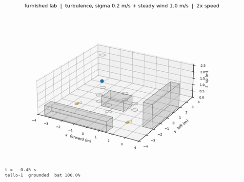
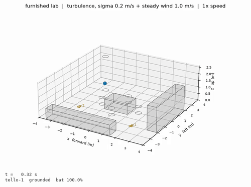

# Tello simulator

A DJI Tello that lives in Python instead of the air. It speaks the real SDK,
over real UDP, so the flight code that talks to it is the flight code that
flies the drone — with wind, battery drain, obstacles and as many drones as you
want, none of which the real one gives you for free.

---

## See it fly

The console on the right is the real `djitellopy` API, typed at a prompt. The
3D view on the left is the same drone, flying the commands as they land.
Nothing is staged: the typing, the timings and the refusals are the real
program's own, and the only edit is playback speed.


*2x speed. Full recording: [`demos/Demo_CLI.mp4`](demos/Demo_CLI.mp4).*

Every flight also renders itself, from the log rather than the screen. The room,
the path actually taken, the wind and the battery, with no operator in the
picture:

| flown from the console | flown from a GUI controller |
|---|---|
|  |  |
| [`console_flight.mp4`](demos/console_flight.mp4) | [`gui_controller_flight.mp4`](demos/gui_controller_flight.mp4) |

*Sped up for the preview. Both flew the furnished lab in a 1.0 m/s draught with
turbulence, against a simulated drone speaking real SDK over real UDP.*

More in [`demos/`](demos/), including the dashboards and the command logs.

---

## The idea in one paragraph

A Tello is not controlled by anything exotic. It listens for plain text on UDP
port 8889 (`takeoff`, `forward 30`, `cw 90`), replies `ok`, and broadcasts a
state string to port 8890 ten times a second. That is the entire interface. So
the simulator is a program that pretends to be the drone: it listens on 8889,
understands the same words, and answers the same way. Nothing in your flight
code changes — you type `127.0.0.1` where you used to type `192.168.10.1`.

Anything that works here works on the drone, and any bug you find here is a
real bug rather than a simulator artefact.

---

## Setup

Any Python 3.9 or newer works:

```bash
python3 -m venv .venv && source .venv/bin/activate
pip install -r requirements.txt
```

On macOS you can double-click `setup.command` from Finder instead, which does
the same thing and then prints what to run next.

One caveat, and only for `run_gui_sim.py`: it needs a Python built with tkinter,
which many pyenv and Homebrew builds are not. If `import tkinter` fails, rebuild
the environment on a Python that has it. On macOS, `/usr/bin/python3 -m venv`
is the dependable choice. Nothing else in the project needs tkinter.

Verified on Python 3.9, 3.12 and 3.13, and the physics is byte-identical across
all three.

---

## Five ways to use it

### 1. Live 3D view, flown from the page

```bash
python run_sim3d.py --wind 1.5 --gusty
```

Opens a browser window with the room, the drone and a control panel: buttons for
take off, land, the six directions, rotation and emergency; sliders for distance,
rotation and speed. The keyboard works too — W A S D to move, R and F for
height, Q and E to turn, T take off, L land, space to hold.

The room you get by default is the **furnished lab** — desks, a table, chairs,
shelving, a pillar — not an empty box, because an empty box shows you nothing.
Fly somewhere else with `--scenario`, see what is available with `--list`, or
get the bare room back with `--empty`:

```bash
python run_sim3d.py --scenario scenarios/07_apartment.yaml
```

Three camera modes: orbit (drag to turn, wheel to zoom, shift-drag to pan),
follow, and a view from the drone itself. The wind field is drawn as arrows that
brighten where the air is moving, so a draught covering only part of the room is
visible rather than implied.

The UDP drone keeps running while the page is up, so the tkinter controller can
attach at the same time and you will watch it fly in 3D:

```bash
python run_gui_sim.py --attach
```

With more than one drone the page gets a selector including **all N drones**,
which sends the same order to every one of them at the same instant, and
minimum separation is shown live.

The picture is only a picture: the drone mesh follows exactly the same equations
as a dot on a plot. What the view adds is seeing what happened, and being able
to fly it by hand.

### 2. Type the library's own calls at a prompt

```bash
python run_cli.py --wind 1.0
```

Same room, same 3D view, but instead of buttons there is a prompt, and what you
type at it is the API:

```
tello> takeoff()
  -> takeoff                      ok                     5.05s
tello> move_forward(100)
  -> forward 100                  ok                     3.85s
tello> rotate_clockwise(90)
  -> cw 90                        ok                     1.62s
tello> get_battery()
98
```

The object at the prompt is a real `djitellopy.Tello` sending real UDP, so this
is the library rather than an imitation of it: the same method names, the same
argument ranges, and the same refusals. Ask for `move_forward(5)` and it comes
back `error forward out of range 20..500`, because that is what the firmware
says.

The point is learning the API by using it. `help` lists every call with what its
arguments mean and what the drone will reject; `help move_forward` gives one in
detail:

```
tello> help go_xyz_speed

  go_xyz_speed(x, y, z, speed)

  Fly to an offset from here, all three axes at once.

  Axes are the drone's own, in centimetres: x forward, y left, z up. Negative
  values go the other way. speed is in cm/s. One diagonal move instead of
  three separate legs, which is both quicker and less error than chaining
  move_forward/left/up.

  Limits
    -500 to 500 cm per axis, speed 10 to 100 cm/s. Refused when all three
    offsets are within 20 cm of zero -- the firmware cannot tell a move that
    small from noise.

  On the wire   go <x> <y> <z> <speed>

  Try           go_xyz_speed(100, 50, 0, 40)
```

Three kinds of line are understood, and the console works out which is which:

| you type | what happens |
|---|---|
| `move_forward(50)` | Python — a call, a loop, an assignment, anything |
| `forward 50` | the raw SDK line, exactly as it goes over UDP |
| `help`, `state`, `where`, `log` | console words |

The raw form is worth using once. `move_forward(50)` and `forward 50` produce
the same flight, and seeing that makes the rest of the library obvious: every
method is a small wrapper that formats one line of text.

Beyond `help`:

| word | what it shows |
|---|---|
| `state` | the telemetry the drone broadcasts, labelled and in units |
| `where` | where the drone **actually** is — ground truth, which no real Tello can give you |
| `log` | every command sent, its answer, and how long it took |
| `sdk` | the raw verbs |
| `demo` | a first flight to copy, one line at a time |
| `run <file>` | execute a file of these lines |

`state` and `where` next to each other are the useful pair: the first is what
the drone believes, the second is what is true, and the gap between them after a
few minutes in wind is the whole argument for an absolute position fix.

Tab completion works on both method names and `help` topics, and the history is
kept between sessions.

Other ways to run it:

```bash
python run_cli.py --attach                    # join a run_sim3d.py already flying
python run_cli.py --drones 3 --in-process     # `swarm` and `drones[0..2]`
python run_cli.py --script warmup.py          # run a file, then stay at the prompt
python run_cli.py --scenario scenarios/06_corridor.yaml
```

`--attach` is the one to use with the 3D view open in another terminal: that
process owns the drone, this one is another client, and both the page's buttons
and your typing reach the same aircraft.

With `--drones N` the console switches to `SimTello`, which has the same methods
and no sockets, and gives you `swarm` alongside `drones[0]` .. `drones[N-1]`.

A flight built at the prompt is a flight script: paste the lines into a `.py`
file, change `127.0.0.1` back to `192.168.10.1`, and it flies the real drone.

### 3. Point an existing GUI controller at it

```bash
python run_gui_sim.py --wind 1.5           # starts its own simulator
python run_gui_sim.py --attach             # joins one that run_sim3d.py is running
```

This imports your controller — the actual file, not a copy — with the IP
already set to `127.0.0.1`. Press **Connect** and fly. Every command is printed
and logged.

No such controller ships with this repository, so pass the path to your own:

```bash
python run_gui_sim.py --controller /path/to/your_controller.py
```

The point of this path is that it changes nothing about the program it runs.
Whatever already flies your drone flies the simulator, with the IP swapped.

### 4. Run a simulated drone and point anything at it

```bash
python run_sim.py --wind 1.0 --gusty
```

Then in any script or notebook:

```python
from djitellopy import Tello        # the real library
drone = Tello(host="127.0.0.1")     # the only change
drone.connect()
drone.takeoff()
```

One caveat, handled for you: djitellopy binds port 8889 locally as well as
sending to it, so two processes on one laptop collide. `tello_sim.patch`
hands it an ephemeral port instead. Call `use_simulator()` before creating a
`Tello`, or just use `run_gui_sim.py`, which does it for you.

### 5. Skip the network entirely — for experiments

```python
from tello_sim import build, World, ConstantWind, SimSpec

world = World(wind=ConstantWind([0.0, 1.5, 0.0]))
sim, swarm = build(n=3, world=world, sim_spec=SimSpec(realtime=False))

swarm.connect()
swarm.takeoff()
swarm.parallel(lambda i, drone: drone.move_forward(150))
swarm.land()
```

`SimTello` has the same methods as `djitellopy.Tello`, but with no sockets it
runs **100–400× faster than real time**, takes any number of drones, and
produces bit-identical logs on repeat runs. Use this for sweeps and swarm work;
use the UDP path to check that real flight code behaves.

Use `drone.sleep(seconds)`, not `time.sleep` — the first advances the
simulation, the second just makes you wait.

---

## What is actually simulated

**Motion.** A point mass with drag. Not four rotors, deliberately: the SDK never
exposes motor commands, so rotor aerodynamics would add parameters nobody can
measure and change nothing you can observe. One equation carries the model:

```
m · dv/dt  =  F_control  −  c · (v − v_wind)
```

Drag acts on velocity *relative to the air*, so wind is a force pushing the
drone downwind whenever it is not already moving with the air. The flight
controller fights back, but only up to `mass × max_accel`. Past that it loses.

**Wind.** Steady, gusty (an Ornstein–Uhlenbeck process, so gusts have realistic
duration), a deterministic burst at a chosen second, a boundary layer that gets
stronger with height, or wind confined to part of the room. They compose, and
any of them can be wrapped in `transient` to switch on at a given second and off
again — which is what a door opening actually looks like: a draught in one place,
for a while, and then not.

**Battery.** Drains faster when manoeuvring and faster still when fighting wind,
because holding a tilt costs power the whole time. Calibrated to roughly 13
minutes of hover. Below 5% the drone lands itself.

**The room.** Boxes and cylinders as obstacles, walls, ceiling, floor. The
downward time-of-flight sensor measures to whatever is under the drone, so
flying over a table makes the reading jump — worth seeing before any policy
treats `tof` as height above the floor.

**Mission pads.** Tello EDU pads, detected only between 0.3 m and 1.2 m, as on
the real hardware. `go x y z speed mid` and `jump` work.

**Several drones.** One shared world, one clock, collisions between them, and
minimum separation reported for every run.

**Imprecision.** Two kinds, kept separate. *Sensor noise* changes what the drone
reports; *actuation error* changes where it actually goes. A relative move lands
a few centimetres off, and the error accumulates, which is why dead reckoning on
a real Tello goes wrong after a dozen moves.

### What is not simulated

No camera **stream**. `streamon` is accepted and does nothing, and there is no
`get_frame_read`. The 3D view does have a drone's-eye camera, so the geometry
and the plumbing for a forward view exist; what is missing is delivering frames
back through the SDK to flight code. That is the piece to build if the
vision-and-language side needs to run in here.

---

## Scenarios

A scenario is one YAML file holding the room, the weather, the drones and the
flight — a complete, re-runnable experiment. `--scenario` uses one as the world
for any of the launchers, so `run_sim3d.py --scenario scenarios/07_apartment.yaml`
drops you into the apartment with the buttons.

```bash
python run_scenario.py scenarios/02_gust_during_move.yaml --video
python run_scenario.py --all --video          # every scenario, start to finish
```

```bash
python run_sim3d.py --list
```

**Rooms.** Places to fly, with furniture, walls and doors in them.

| file | what is in it |
|---|---|
| `00_lab_room.yaml` | desks, a meeting table, chairs, shelving, a pillar. **The default** |
| `03_obstacles.yaml` | a smaller cluttered room; `tof` jumps when you cross the table |
| `06_corridor.yaml` | two 90 cm doorways and a cross-draught at the first one |
| `07_apartment.yaml` | three rooms, two doorways, a pad in each, a draught between them |
| `08_slalom.yaml` | five pillars to weave through in a crosswind |
| `09_warehouse.yaml` | four racks, three aisles, one drone per aisle |
| `10_open_window.yaml` | a furnished room where a 3 m/s gust arrives through one window |

**Physics tests.** Empty on purpose: one thing varies and nothing else.

| file | what it measures |
|---|---|
| `01_hover_wind.yaml` | how far a steady draught pushes a hovering drone off station |
| `02_gust_during_move.yaml` | a hard gust arriving mid-leg, at a known second |
| `04_swarm_formation.yaml` | three drones, a one-sided draught, minimum separation |
| `05_endurance.yaml` | patrol until the battery, not the instruction, ends it |

Check them all for geometry mistakes — a drone starting inside a wall, a mission
pad hidden under a desk — and optionally fly each one:

```bash
python scripts/check_scenarios.py --fly
```

---

## What every run records

```
logs/<timestamp>_<name>/
  commands.jsonl    every command received, its answer, and how long it took
  telemetry.csv     position, velocity, battery and wind, 10 Hz
  events.jsonl      collisions, timeouts, battery warnings
  run.json          the scenario and every constant used
  dashboard.png     flight path, altitude, battery, wind
  flight.mp4        the video
```

The command log answers "what did the drone actually receive?" directly, and the
formats are the same for a simulated and a real flight — so the two can be
compared line by line.

---

## Calibrating it against the real drone

Every physical constant is in `tello_sim/config.py`, and the ones worth
measuring are marked `CALIBRATE`. All you need is a real flight with each
command wrapped in `time.perf_counter()`:

1. Fly the real drone, timing every command, and keep the numbers.
2. Put the measured values into `config.py`: `takeoff_duration`,
   `land_duration`, `drain_hover`, `move_error_std`.
3. Re-run the same flight in the simulator and compare the two `commands.jsonl`
   files. Where the durations disagree, a constant is wrong.

Until that is done, treat the absolute numbers as plausible rather than
measured. The *shape* of the results — that position error grows roughly
linearly with wind and then collapses past about 2.5 m/s — comes from the
physics and does not depend on the constants being exact.

---

## One result worth knowing about

`06_corridor.yaml` was built to test whether the drone could fly through a 90 cm
doorway during a cross-draught. It can. Then it crashes into the *second*
doorway, in still air, seven seconds after the wind has stopped — in eight runs
out of eight, across eight seeds.

Nothing puts the drone back on centreline, because every SDK move is
*relative*. The gust shoves it half a metre sideways, it flies the rest of the
corridor perfectly, parallel to where it should be, and arrives at a gap it no
longer fits through. The disturbance and the failure are in different places and
twelve seconds apart, so at the moment of the crash there is nothing in the
telemetry to react to.

This was not designed in — it fell out of the physics, and it is the clearest
argument in the whole set for why an absolute position fix matters. The mission
pad sitting unused on the corridor floor is the fix; the script deliberately
does not use it.

---

## Where the wind limit comes from

Holding station against a wind of speed `w` needs an acceleration of
`drag_coeff × w / mass`. With the default constants that hits the control
authority limit at:

```
w = max_accel_xy × mass / drag_coeff = 3.5 × 0.080 / 0.11 ≈ 2.5 m/s
```

Below that the drone holds with a steady offset downwind. Above it, the air
wins. Measured from a wind sweep (`scripts/demo_wind_sweep.py`), a square patrol
of four 1.5 m legs:

| wind (m/s) | closing error (m) | battery used (%) |
|---:|---:|---:|
| 0.0 | 0.05 | 4.5 |
| 1.0 | 0.52 | 5.6 |
| 2.0 | 1.07 | 7.0 |
| 2.5 | 3.20 | 7.6 |
| 3.0 | 12.64 | 10.7 |

---

## Layout

```
tello_sim/
  config.py       every physical constant, in one place
  dynamics.py     the equation of motion, and the attitude that follows from it
  wind.py         wind fields
  world.py        room, obstacles, mission pads, collisions
  actions.py      what the drone is currently trying to do
  drone.py        SDK command parsing, telemetry, one aircraft
  simulator.py    the clock; steps every drone through one world
  server.py       the fake Tello on UDP 8889
  patch.py        lets djitellopy share this machine with it
  client.py       SimTello and SimSwarm, the no-network path
  cli.py          the interactive prompt
  cli_docs.py     the API reference `help` prints
  recorder.py     logs
  render.py       dashboards and videos
  scenarios.py    YAML scenarios
  webviewer.py    the HTTP server behind the live 3D view
  viewer/         the page itself: index.html, app.js, and three.js vendored
```

### Why the 3D view is a web page

PyBullet would have been the obvious choice and was tried first. It has no
prebuilt wheel for Apple silicon, so it compiles from source, and its window
insists on owning the main thread, which collides with tkinter. A page served
over localhost needs nothing compiled, has no window-manager fights, renders
well, and can be shown on someone else's laptop or screen-recorded. three.js is vendored in `viewer/vendor/`, so it works with no
internet.

---

## Notes and limits

- **Several drones over UDP** need one IP each, because djitellopy tells drones
  apart by source address. On macOS: `sudo ifconfig lo0 alias 127.0.0.2 up`.
  For swarm work the in-process path is easier and has no such limit.
- **`rc` and `emergency` get no reply**, matching the firmware. Answering them
  would leave a stray `ok` for the *next* command to consume.
- **Videos** are MP4 when `imageio-ffmpeg` is installed (it is in
  `requirements.txt`), and animated GIF otherwise.
- **The 3D view is a client, not a privileged one.** It reads state and sends
  SDK commands over HTTP on port 8080; it cannot do anything the drone would not
  accept from the real controller. It has to send `command` before the drone
  will listen, exactly like everything else.
- **Determinism** holds for the in-process path with a fixed seed: same
  scenario, byte-identical telemetry. The UDP path depends on real network
  timing and is not reproducible in that sense.
