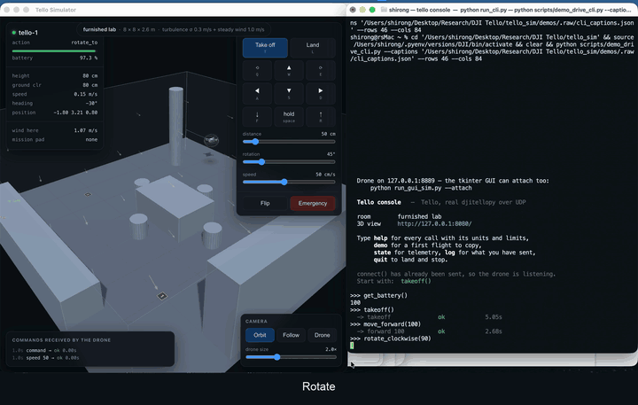

# Tello simulator

A DJI Tello in Python. It speaks the real SDK over real UDP, so code that flies
the drone flies the simulator: change `192.168.10.1` to `127.0.0.1` and nothing
else. On top of that it gives you what the real drone cannot on demand: wind,
battery drain, moving obstacles, several drones, and repeatable scored runs.



*The real `djitellopy` API typed at a prompt (right) flying the 3D view (left),
at 2x speed. Full recording: [`demos/Demo_CLI.mp4`](demos/Demo_CLI.mp4). More
flights, dashboards and command logs are in [`demos/`](demos/).*

---

## Setup

Python 3.10 or newer, because MuJoCo publishes no wheels for older versions.

```bash
python3.12 -m venv .venv && source .venv/bin/activate
pip install -r requirements.txt
```

On macOS, double-clicking `setup.command` does the same and picks an interpreter
for you.

- If pip stops with `MUJOCO_PATH environment variable is not set`, the Python
  is too old.
- Only `run_gui_sim.py` needs tkinter. Check with
  `python -c "import tkinter"`. Homebrew and pyenv builds often lack it; for
  Homebrew, `brew install python@3.13 python-tk@3.13`, then
  `rm -rf .venv && ./setup.command`.

---

## Ways to use it

| to | run |
|---|---|
| fly by hand in a 3D view | `python run_sim3d.py` |
| type library calls at a prompt | `python run_cli.py` |
| run your own GUI controller | `python run_gui_sim.py --controller your_controller.py` |
| point any script or notebook at it | `python run_sim.py` |
| run experiments with no network | `from tello_sim import build` |
| score scenarios | `python run_benchmark.py --all` |
| replay a scenario to video | `python run_scenario.py <file> --video` |

Most launchers also take `--wind 1.5 --gusty`, `--scenario <file>`,
`--drones 3`, `--no-collisions`, `--list` and `--empty`.

### 3D view

`run_sim3d.py` opens a browser page with the room, the drone and a control
panel. Keys: W A S D move, R and F climb and descend, Q and E turn, T takes off,
L lands, space holds. There are three cameras (orbit, follow, and the drone's
own view), and wind is drawn as arrows. With several drones the page can order
all of them at once and shows their minimum separation.

The simulated drone stays up while the page is open, so `run_cli.py --attach`
or `run_gui_sim.py --attach` can fly it at the same time.

### Console

`run_cli.py` gives a prompt where you type the library's own calls. The object
is a real `djitellopy.Tello` over real UDP, so its refusals are the firmware's:
`move_forward(5)` answers `error forward out of range 20..500`.

```
tello> takeoff()
  -> takeoff                      ok                     5.05s
tello> move_forward(100)
  -> forward 100                  ok                     3.85s
tello> get_battery()
98
```

- `help` lists every call with units and limits. `help move_forward` explains
  one.
- Raw SDK lines work too. `forward 50` flies the same as `move_forward(50)`.
- `state` shows what the drone reports and `where` shows where it really is.
  After a few minutes of wind, the gap between them is the case for an absolute
  position fix.
- `log`, `sdk`, `demo` and `run <file>` do what they say.
- `--drones 3 --in-process` gives you `swarm` and `drones[0..2]`.

A flight built at the prompt is a flight script. Paste it into a file, set the
IP back to `192.168.10.1`, and it flies the real drone.

### Your own code

```bash
python run_sim.py --wind 1.0 --gusty
```

```python
from tello_sim.patch import use_simulator
use_simulator()    # djitellopy and the simulator both want port 8889

from djitellopy import Tello
drone = Tello(host="127.0.0.1")
drone.connect()
drone.takeoff()
```

`run_gui_sim.py` does the patching for you and runs an existing tkinter
controller unchanged. No controller ships here: pass yours with `--controller`
or set `TELLO_CONTROLLER`.

### Experiments, with no network

```python
from tello_sim import build, World, ConstantWind, SimSpec

world = World(wind=ConstantWind([0.0, 1.5, 0.0]))
sim, swarm = build(n=3, world=world, sim_spec=SimSpec(realtime=False))

swarm.connect()
swarm.takeoff()
swarm.parallel(lambda i, drone: drone.move_forward(150))
swarm.land()
```

`SimTello` has the same methods as `djitellopy.Tello` but no sockets. It runs
30 to 45 times faster than real time, takes any number of drones, and gives
byte-identical logs for the same seed. Use `drone.sleep(seconds)`, not
`time.sleep`: only the first one moves simulated time.

---

## What is simulated

- **Motion.** A MuJoCo rigid body. The drone is a flat disc that has to tilt
  before it can accelerate sideways, as a real quadrotor does, so a drone
  knocked sideways must fly itself level again. Individual rotors are not
  modelled: the SDK never exposes motor commands, so their constants could
  never be measured.
- **Contacts.** Real ones, from the solver. Clip a doorframe and the drone is
  slowed and turned; clip a crate and the crate falls over. With collisions off,
  drones pass through everything but the floor and still report what they
  would have hit. (`--no-collisions`, or `collisions: false` under `sim:` in a
  scenario file.)
- **Wind.** Drag on the drone's velocity relative to the air. Steady, gusty
  (Ornstein-Uhlenbeck), a burst at a set second, stronger with height, or
  confined to part of the room. Fields add together, and `transient` switches
  one on and off, the way an opened door does.
- **Battery.** Drains faster the harder the drone works and the faster it moves
  through the air, so fighting wind costs charge. About 13 minutes of hover.
  Below 5% the drone lands itself.
- **Rooms.** Walls, ceiling, floor, and boxes, cylinders and spheres. An
  obstacle can be fixed, scripted (`waypoints`, `orbit`, `swing`: a door, a
  person pacing) or `dynamic` (has mass and topples). Scripted ones cannot be
  pushed, so a door closes on schedule in every run. Obstacles can be added,
  moved or removed mid-flight.
- **Sensors.** The downward time-of-flight reading measures to whatever is
  below, so it jumps over a table. Tello EDU mission pads are seen from 0.3 m
  to 1.2 m, and `go x y z speed mid` and `jump` work.
- **Several drones.** One world, one clock, collisions between drones, and the
  minimum separation of every run.
- **Imprecision.** Sensor noise changes what the drone reports. Actuation error
  changes where it goes: each relative move lands a few centimetres off, and
  the errors add up, as dead reckoning does on a real Tello.

### Not simulated

- **Camera stream.** `streamon` does nothing and there is no `get_frame_read`.
  The 3D view has a drone's-eye camera, but no frames go back to flight code.
- **Hover drift.** A hovering drone does not drift, and `land` comes straight
  down on its true position. A real Tello holds position with a downward camera
  that, per its manual, only works from about 0.3 m up and struggles over
  plain, shiny or dark floors. So the simulator lands on a mission pad far more
  often than the drone does. The drift to add should come from measured pad
  misses, not a guess.
- **What vision-and-language navigation needs.** Besides the camera:
  instructions (a benchmark has a goal point, not a sentence); a stop decision
  (a benchmark ends when its script runs out, so SR against OSR measures the
  script, not a policy); and scenes a camera could recognise (obstacles are
  plain coloured shapes, in 14 hand-built scenarios with no generator).

---

## Scenarios

A scenario is one YAML file holding the room, the weather, the drones and the
script. Every launcher takes `--scenario`. The ones marked * are scored.

| file | what it tests |
|---|---|
| `00_lab_room` | desks, table, chairs, shelving, a pillar. **The default room** |
| `01_hover_wind` | how far a steady draught pushes a hovering drone |
| `02_gust_during_move` | a hard gust at a known second, mid-leg |
| `03_obstacles` | a cluttered room; `tof` jumps over the table |
| `04_swarm_formation` | three drones in a one-sided draught |
| `05_endurance` | patrol until the battery ends it |
| `06_corridor` * | two 90 cm doorways, a cross-draught at the first |
| `07_apartment` | three rooms, two doorways, a pad in each |
| `08_slalom` * | five pillars in a crosswind |
| `09_warehouse` | four racks, three aisles, one drone per aisle |
| `10_open_window` * | a 3 m/s gust through one window |
| `11_moving_door` * | a door on a six second cycle |
| `12_crowded_hall` * | four people pacing, a stack of crates |
| `13_knock_over` | a tower of foam bricks to fly into |

```bash
python run_scenario.py scenarios/02_gust_during_move.yaml --video
python scripts/check_scenarios.py --fly    # check geometry, then fly each one
```

---

## Benchmarks

A `benchmark:` block in a scenario adds a goal, a radius and a deadline:

```yaml
benchmark:
  goal: [2.0, 0.0, 0.8]
  success_radius: 0.5
  time_limit: 45
```

```bash
python run_benchmark.py --all                          # every scored scenario
python run_benchmark.py scenarios/08_slalom.yaml --seeds 10
python run_benchmark.py --all --ablate-collisions      # contacts on vs off
python run_benchmark.py scenarios/08_slalom.yaml --wind 0 0.5 1.0 1.5
```

| metric | meaning |
|---|---|
| SR | share of runs that finished inside the goal radius |
| OSR | share that passed inside it at any point |
| SPL | success weighted by path length; 1.0 is a straight line |
| NE | metres from the goal at the end |
| energy | battery percent used |
| crash | share of runs with at least one collision |
| clear | smallest gap between the cage and a wall, the ceiling or an obstacle. Zero or below is contact |

The first four carry the names aerial vision-and-language navigation papers
use, but the numbers are not comparable with published ones, which come from
other environments and tasks. Each scenario runs over several seeds (5 by
default), because noise and gust timing come from the seed. Every run's details
are written to JSON.

**Collision ablation.** `--ablate-collisions` flies each scenario solid and as
a ghost:

```
condition                    n    SR   OSR   SPL    NE(m)  energy%  crash  clear(m)
corridor [solid]             5  0.20  0.20  0.18     5.27      6.5   0.80     -0.01
corridor [ghost]             5  0.20  0.20  0.18     1.12      6.7   0.80     -0.38
```

Solid, the drone ends 5 m short of the goal. As a ghost, 1 m. So the route is
roughly right, and most of the failure is the drone catching on doorframes.

### One result worth knowing

In `06_corridor`, the draught at the first doorway stops most runs. Of the 7
runs in 20 that get past it, 6 then hit the *second* doorway, in still air, 7
to 11 seconds after the wind has stopped.

Every SDK move is relative, so nothing puts the drone back on centreline. It
flies on, parallel to its route, and reaches a gap it no longer fits through.
When it crashes there is nothing in the telemetry to react to. This fell out of
the physics rather than being designed in, and it is the clearest case for an
absolute position fix. The mission pad on the corridor floor would give one;
the script deliberately ignores it. Results at other draught speeds are in the
scenario file.

### Where the wind limit comes from

The controller can push back with at most `max_accel_xy`, and holding still
against a wind of speed `w` takes `drag_coeff × w / mass`. So the drone loses at

```
w = max_accel_xy × mass / drag_coeff = 3.5 × 0.080 / 0.11 ≈ 2.5 m/s
```

Below that it holds with a steady offset downwind. A square patrol of four
1.5 m legs (`scripts/demo_wind_sweep.py`):

| wind (m/s) | closing error (m) | battery used (%) |
|---:|---:|---:|
| 0.0 | 0.05 | 4.6 |
| 0.5 | 0.25 | 5.0 |
| 1.0 | 0.52 | 5.7 |
| 1.5 | 0.80 | 6.4 |
| 2.0 | 1.05 | 7.1 |
| 2.5 | 4.36 | 7.8 |
| 3.0 | 12.24 | 10.8 |

---

## Logs and calibration

Every run writes:

```
logs/<timestamp>_<name>/
  commands.jsonl    every command, its answer, and how long it took
  telemetry.csv     position, velocity, battery and wind, 10 Hz
  events.jsonl      collisions, timeouts, battery warnings
  obstacles.jsonl   poses of moving obstacles, 10 Hz, when there are any
  run.json          the scenario and every constant used
  dashboard.png     flight path, altitude, battery, wind
  flight.mp4        the video (a GIF if imageio-ffmpeg is missing)
```

A real flight logged in the same format can be compared line by line, and
rendered by the same code.

The physical constants live in `tello_sim/config.py`. The ones marked
`CALIBRATE` are plausible, not measured. To calibrate:

1. Fly the real drone, timing each command with `time.perf_counter()`.
2. Put the measured values into `config.py`: `takeoff_duration`,
   `land_duration`, `drain_hover`, `move_error_std`.
3. Fly the same script in the simulator and compare the two `commands.jsonl`
   files. Where durations disagree, a constant is wrong.

Until then, trust the shapes of results more than the absolute numbers.

---

## How it works

**Two ways in, one drone.** `server.py` is a UDP endpoint on port 8889 that
behaves like the aircraft. `SimTello` in `client.py` calls the drone directly
with no sockets. Both hand plain SDK text to the same `SimDrone`, so anything
seen through one shows up through the other.

**Commands become actions.** `drone.py` parses each line and applies the
firmware's limits. A valid command becomes an `Action` from `actions.py`
(`MoveTo`, `RotateTo`, `CurveThrough`, `Flip`, `RCVelocity`, `TakeOff`, `Land`,
`Hover`): a small state machine asked every tick what acceleration it wants and
whether it has finished. The caller waits until it finishes and then gets `ok`,
as with the real drone. Relative moves get their random landing error here.

**One tick**, every 5 ms by default, in `simulator.py`:

1. The wind field moves on (`wind.py`).
2. Each drone's action runs a position controller: position error gives a
   desired velocity, which gives an acceleration, capped at `max_accel_xy`. It
   is proportional only, so a steady wind leaves an offset you can measure.
3. `physics.py` turns that acceleration into thrust along the body's actual
   up-axis plus a torque that tilts it, and adds drag from the wind.
4. Scripted obstacles are placed, then MuJoCo steps all drones together, so
   contacts in a swarm do not depend on list order.
5. Each drone does its bookkeeping: battery drain, collisions (a surface must
   stay clear for 0.5 s before touching it counts again), mission pads, and
   finishing the current command.
6. Benchmark probes record the position. Every 100 ms, telemetry goes out on
   port 8890 and into the log.

**Two clocks.** `realtime=True` sleeps to keep pace with the wall clock, so the
real library's timeouts behave as in the air. `realtime=False` runs flat out,
and a blocking call steps the simulation itself until its command finishes.

**The room is compiled.** `world.py` keeps the room, obstacles and pads as
Python objects. `physics.py` compiles them into a MuJoCo model at the start,
and again when an obstacle is added or removed.

**Everything after the flight reads the log.** `render.py` draws dashboards and
videos from the log files, never from a live run. The 3D view (`webviewer.py`,
`viewer/`) is just another client: it reads state and sends SDK commands over
HTTP on port 8080, and three.js draws what MuJoCo computed.

### Layout

```
tello_sim/
  config.py       every physical constant
  physics.py      MuJoCo model, thrust and attitude control, contacts
  dynamics.py     drone state, frame conversions, battery
  wind.py         wind fields
  world.py        room, obstacles and their motion, mission pads
  actions.py      what the drone is currently doing
  drone.py        SDK parsing, limits, telemetry
  simulator.py    the clock
  server.py       the fake drone on UDP 8889
  patch.py        lets djitellopy share the machine with it
  client.py       SimTello and SimSwarm
  benchmark.py    goals, metrics, seed runner
  scenarios.py    YAML loading
  recorder.py     logs
  render.py       dashboards and videos
  cli.py          the prompt; cli_docs.py is its help text
  webviewer.py    HTTP server for the 3D view; viewer/ is the page
```

### Design choices

- **MuJoCo, not PyBullet.** PyBullet has no Apple silicon wheel and its window
  wants the main thread, which clashes with tkinter. MuJoCo's own viewer has
  the same problem on macOS, so it computes and three.js draws. three.js is
  vendored, so the view works offline.
- **Timestep.** Free flight is the same to a millimetre at every step size;
  only contacts change. At `dt: 0.02` a drone falling at 4 m/s passes straight
  through a 4 cm shelf, which would silently spoil a sweep. The default 0.005
  is safe. Use `dt: 0.01` for about twice the speed when nothing is thin and
  nothing falls far.

| `dt` | speed | 4 m/s fall onto a 4 cm shelf |
|---|---|---|
| 0.002 | ~31x | caught, 0.3 cm penetration |
| **0.005** (default) | **~76x** | caught, 2.0 cm penetration |
| 0.010 | ~150x | caught, 1.3 cm penetration |
| 0.020 | ~300x | **falls through** |

*Speeds are for stepping alone; a full scenario run, model building included,
is 30 to 45 times real time.*

---

## Notes and limits

- **Several drones over UDP** need one IP each, because djitellopy tells drones
  apart by address. On macOS: `sudo ifconfig lo0 alias 127.0.0.2 up`. The
  in-process path has no such limit.
- **`rc` and `emergency` get no reply**, as on the real firmware. A reply would
  be consumed by the next command.
- **Determinism** holds for the in-process path with a fixed seed. The UDP path
  depends on network timing.
